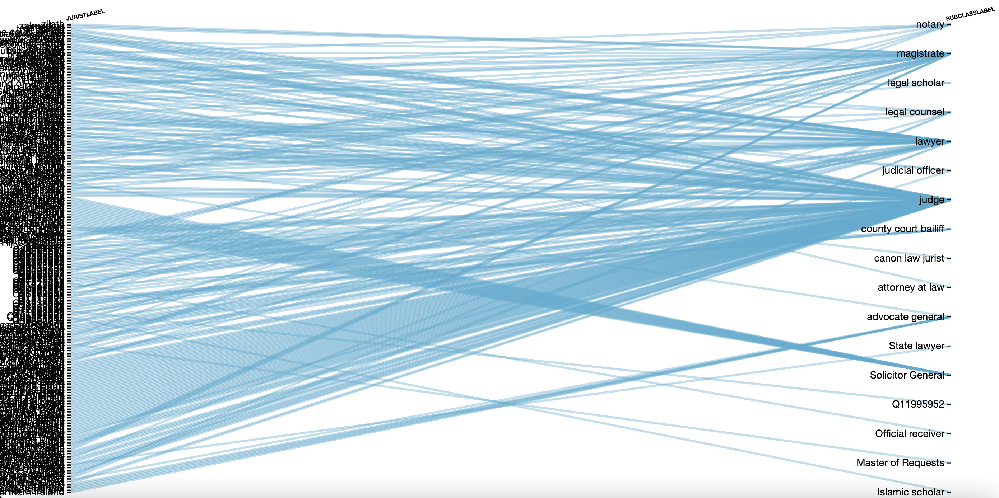

## Wikidata's labyrinth of categorization

Wikidata is a powerful reference work. It's a great place to look up dates, geolocations, and lists. As time goes on, it should become better and better at this job.

Humanists, however, will discover Wikidata's real buzz only when they enter its transfixing labyrinth of categorization. Wikidata (and the [RDF data model](https://en.wikipedia.org/wiki/Resource_Description_Framework) on which it is based) uses classes, subclasses, and superclasses to organize its universe. According to this theory of knowledge, any item can be situated vis-a-vis all other items using classes.

The Wikidata entry for [Gillian Welch](https://www.wikidata.org/wiki/Q442207), for example, lists the following occupations:
- [singer-songwriter](https://www.wikidata.org/wiki/Q488205)
- [singer](https://www.wikidata.org/wiki/Q177220)
- [guitarist](https://www.wikidata.org/wiki/Q855091)
- [composer](https://www.wikidata.org/wiki/Q36834)
- [recording artist](https://www.wikidata.org/wiki/Q55960555)

Or, to restate this slightly more accurately, individual Wikidata editors have chosen to assign these five [occupation](https://www.wikidata.org/wiki/Property:P106) properties to her Wikidata resource.

Let's take a closer look at these occupations. Each of is a subclass of one or more broader, superclass occupations:

subclass|superclass|superclass|superclass|superclass|superclass|superclass
---|---|---|---|---|---|---
[singer-songwriter](https://www.wikidata.org/wiki/Q488205)|[singer](https://www.wikidata.org/wiki/Q177220)|[vocalist](https://www.wikidata.org/wiki/Q2643890)|[musician](https://www.wikidata.org/wiki/Q639669)|[artist](https://www.wikidata.org/wiki/Q483501)|[professional](https://www.wikidata.org/wiki/Q702269)|[human](https://www.wikidata.org/wiki/Q5)
 |  ↳ |[musician](https://www.wikidata.org/wiki/Q639669)| --> |[artist](https://www.wikidata.org/wiki/Q483501)|[professional](https://www.wikidata.org/wiki/Q702269)|[human](https://www.wikidata.org/wiki/Q5)
 ↳ |[songwriter](https://www.wikidata.org/wiki/Q753110)|[composer](https://www.wikidata.org/wiki/Q36834)|[musician](https://www.wikidata.org/wiki/Q639669)|[artist](https://www.wikidata.org/wiki/Q483501)|[professional](https://www.wikidata.org/wiki/Q702269)|[human](https://www.wikidata.org/wiki/Q5)
 | ↳ |[author](https://www.wikidata.org/wiki/Q482980)|[creator](https://www.wikidata.org/wiki/Q2500638)|[professional](https://www.wikidata.org/wiki/Q702269)| --> |[human](https://www.wikidata.org/wiki/Q5)
 | | | ↳ |[producer](https://www.wikidata.org/wiki/Q13235160)|[source](https://www.wikidata.org/wiki/Q31464082)|[object](https://www.wikidata.org/wiki/Q488383)
[singer](https://www.wikidata.org/wiki/Q177220)|[vocalist](https://www.wikidata.org/wiki/Q2643890)| --> |[musician](https://www.wikidata.org/wiki/Q639669)|[artist](https://www.wikidata.org/wiki/Q483501)|[professional](https://www.wikidata.org/wiki/Q702269)|[human](https://www.wikidata.org/wiki/Q5)
 ↳ |[musician](https://www.wikidata.org/wiki/Q639669)| --> | -->|[artist](https://www.wikidata.org/wiki/Q483501)|[professional](https://www.wikidata.org/wiki/Q702269)|[human](https://www.wikidata.org/wiki/Q5)
[guitarist](https://www.wikidata.org/wiki/Q855091)|[instrumentalist](https://www.wikidata.org/wiki/Q1278335)| --> |[musician](https://www.wikidata.org/wiki/Q639669)|[artist](https://www.wikidata.org/wiki/Q483501)|[professional](https://www.wikidata.org/wiki/Q702269)|[human](https://www.wikidata.org/wiki/Q5)
[composer](https://www.wikidata.org/wiki/Q36834)|[musician](https://www.wikidata.org/wiki/Q639669)| --> | -->|[artist](https://www.wikidata.org/wiki/Q483501)|[professional](https://www.wikidata.org/wiki/Q702269)|[human](https://www.wikidata.org/wiki/Q5)
 ↳ |[author](https://www.wikidata.org/wiki/Q482980)|[creator](https://www.wikidata.org/wiki/Q2500638)|[professional](https://www.wikidata.org/wiki/Q702269)| --> | --> |[human](https://www.wikidata.org/wiki/Q5)
 | |  ↳|[producer](https://www.wikidata.org/wiki/Q13235160)| --> |[source](https://www.wikidata.org/wiki/Q31464082)|[object](https://www.wikidata.org/wiki/Q488383)
[recording artist](https://www.wikidata.org/wiki/Q55960555)|[musician](https://www.wikidata.org/wiki/Q639669)| --> | --> |[artist](https://www.wikidata.org/wiki/Q483501)|[professional](https://www.wikidata.org/wiki/Q702269)|[human](https://www.wikidata.org/wiki/Q5)

A careful reading of this chain of classes immediately raises questions. What does duplication and circularity mean? Is an artist really a kind of professional? Is a producer a subclass of object?

Wikidata is filled with puzzles of this kind, in every domain of knowledge. It is a window into the foundation of practical categorization that undergirds the world wide web's model of existence. Look upon this ontology, humanists, and despair/delight. (And don't forget, you are encouraged to fix it too.)

## Where is the entrance to this labyrinth?

The entrance is Wikidata's [query portal](https://query.wikidata.org/). This portal can be used for many purposes. Here we will use it to explore categorization schemas.

Let's say that you are interested in law. How does Wikipedia categorize workers in the law? [Jurist](https://www.wikidata.org/wiki/Q185351) is a useful apex class of legal occupation. Here's a SPARQL query that shows one layer of subclasses between individuals workers and the Jurist superclass.

```
SELECT ?jurist ?juristLabel ?subClassLabel ?subClass
WHERE
{
  ?jurist wdt:P279 ?subClass.
  ?subClass wdt:P279 wd:Q185351.
  SERVICE wikibase:label { bd:serviceParam wikibase:language "[AUTO_LANGUAGE],en". }
}
```
[View this query in Wikidata](https://w.wiki/36bK). Press the blue triangle "play" button on the left. You'll see a list of about 300 labels (i.e. names) of jurists and subclasses, as well as links to their wikidata items.

Just below the "play" button is an icon that says "Table." This button offers a selection of (mostly not very useful) visualizations. Choose "Dimensions," and you will see a summary of the relationship between individuals and the subclasses of jurist. The image below (which doesn't display the item IDs) shows that judge lawyer, and magistrate are most popular. It also shows that "Solicitor General" has been the topic of sustained work in a single series of records. The rest of the subclasses are rather more rare.



This is not a definitive list of subclasses of Jurist, however. Let's consider the same query, but invoking two sets of intermediate classes:

```
SELECT ?itemLabel ?lowerMiddleClassLabel ?upperMiddleClassLabel
WHERE
{
  ?item wdt:P279 ?lowerMiddleClass.
  ?lowerMiddleClass wdt:P279 ?upperMiddleClass.
  ?upperMiddleClass wdt:P279 wd:Q185351.
  SERVICE wikibase:label { bd:serviceParam wikibase:language "[AUTO_LANGUAGE],en". }
}
```

[View it in Wikidata](https://w.wiki/36cu). This is a different set of about 400 individuals: those whose occupation is a subclass of a subclass of jurist.


Again, the virtues and faults of the categorization scheme are apparent--as is the folly of all human endeavor.


There are many possible permutations for Wikidata categorization study of this kind. Try one of the SPARQL queries above, but substitute your own apex category for `Q185351`. The query form autopopulates if you press control-space when your cursor hovers over the item number.

## How about properties?

You'll want to understand the various properties used to describe items in your domain. We can adapt a [Wikidata example query about properties of animals in zoos](https://www.wikidata.org/wiki/Wikidata:SPARQL_query_service/queries/examples#Properties_connecting_items_of_type_zoo_(Q43501)_with_items_of_type_animal_(Q729)) to look at our jurists.
